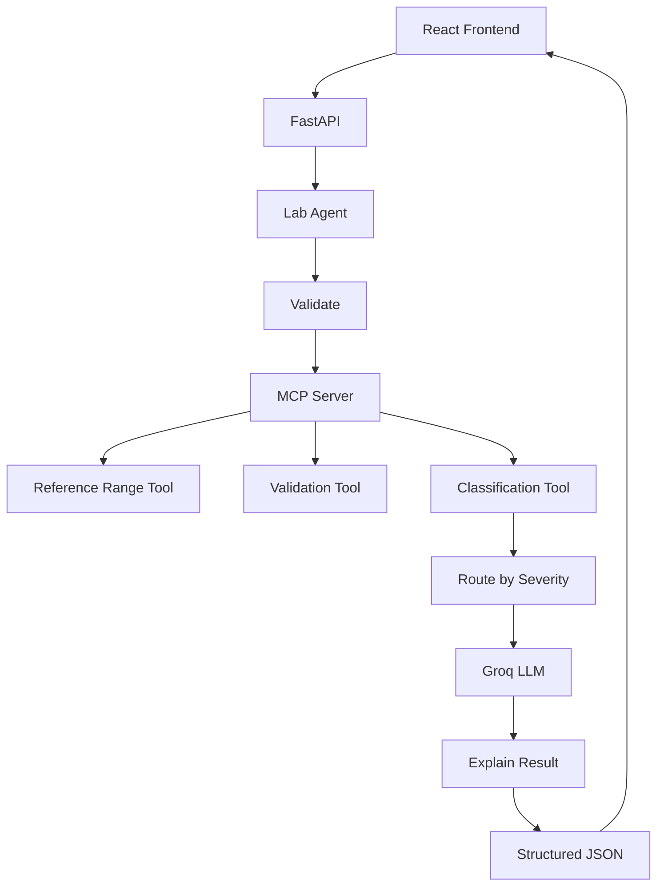

# Clinical Lab AI Analyzer

Explainable AI Laboratory Result Classification System — a full-stack web application that analyzes laboratory test results, classifies them as Normal / Warning / Critical, routes results by severity, and uses the Groq API to generate clinically relevant, explainable interpretations.

## Repository

> **GitHub:** Replace with your public repo URL after pushing, e.g. `https://github.com/your-username/clinical-lab-ai-analyzer`

## Overview

Clinical laboratories produce many test results every day. Healthcare providers need a fast way to identify abnormal results and understand their significance. This application accepts lab results via manual input or CSV upload, validates them, looks up reference ranges, classifies each result deterministically, and generates AI-powered explanations for every result.

**This is an educational/demo clinical decision-support application. It does not diagnose patients.**

## Problem Statement

Healthcare providers need to quickly identify abnormal lab results, understand their clinical significance, and decide on appropriate next steps — with full transparency into *why* each result was flagged.

## Features

- Manual lab result input (multiple tests)
- CSV upload with preview, validation, and invalid row highlighting
- Deterministic classification: NORMAL / WARNING / CRITICAL / UNKNOWN
- Severity-based routing (Critical → Warning → Normal → Unknown)
- Groq LLM explanations for **every** result
- Explainable AI dashboard with value, reference range, severity, why flagged, clinical significance, and suggested next steps
- MCP server with laboratory analysis tools
- Reference range lookup from configurable JSON database

## Demo Screen Short


## Architecture



## Technology Stack

| Layer | Technologies |
|-------|-------------|
| Frontend | React, Vite, JavaScript, Axios, CSS |
| Backend | Python 3.10+, FastAPI, Pydantic, Uvicorn |
| AI | Groq API (`openai/gpt-oss-20b`) |
| Agent | Python MCP SDK |
| Data | Pandas, JSON reference ranges |
| Testing | Pytest, FastAPI TestClient, HTTPX |

## Agent Architecture

The lab agent follows a **CLASSIFY → ROUTE → EXPLAIN** pipeline:

1. **Validate** — MCP `validate_lab_result` tool checks input
2. **Reference Lookup** — MCP `reference_range_lookup` tool finds ranges
3. **Classify** — MCP `classify_lab_result` tool applies deterministic rules
4. **Route** — Group and order by severity
5. **Explain** — Groq LLM generates structured explanation for each result

## MCP Architecture

The MCP server (`backend/mcp/server.py`) exposes three tools:

- `reference_range_lookup` — Find reference ranges for known tests
- `validate_lab_result` — Validate test name, value, and unit
- `classify_lab_result` — Deterministic Normal/Warning/Critical classification

The lab agent communicates through an MCP client (`backend/mcp/client.py`).

## AI Provider — Why Groq?

This project uses **[Groq](https://console.groq.com)** as the GenAI provider.

| Reason | Detail |
|--------|--------|
| Free tier | Easy to get started with a free API key |
| Fast inference | Low-latency responses for demo and batch analysis |
| OpenAI-compatible API | Simple Python SDK integration |
| Structured JSON output | Reliable explanation parsing for every lab result |

**Model:** `openai/gpt-oss-20b` (set via `GROQ_MODEL` in `.env`)

**Important:** Classification (Normal / Warning / Critical) is **deterministic** using reference ranges. Groq is used **only for explanations**, not for deciding severity.

## Groq Integration

- API key stored in `backend/.env` (never exposed to the frontend)
- Model: `openai/gpt-oss-20b` (configurable via `GROQ_MODEL`)
- LLM generates explanations for **every** result — including Normal
- Retry once on parse failure; safe fallback if Groq is unavailable

## Dataset

This project uses the Kaggle dataset: **[Laboratory Test Results – Anonymized Dataset](https://www.kaggle.com/datasets/pinuto/laboratory-test-results-anonymized-dataset)** by pinuto.

| Item | Value |
|------|-------|
| Source file | `data/kaggle/lab_test_results_public.csv` |
| Rows | 27 anonymized lab results |
| Columns | Date, Test_Name, Result, Unit, Reference_Range, Status, Comment, etc. |

### Download

```bash
pip install kaggle
python scripts/download_dataset.py
```

Or download manually from the [Kaggle page](https://www.kaggle.com/datasets/pinuto/laboratory-test-results-anonymized-dataset) and place `lab_test_results_public.csv` in `data/kaggle/`.

### Preprocess

```bash
python scripts/preprocess_dataset.py
```

### How the dataset is used

- **Inspection** — `dataset_summary.json` with row counts and status distribution
- **Test name aliases** — maps Kaggle names (`Lökosit`, `Trombosit`) to app reference keys
- **Unit conversion** — Kaggle `10^3/uL` → `cells/uL` for WBC and platelets
- **Demo CSV** — `test_data/kaggle_sample.csv` extracted from real Kaggle rows
- **API endpoints** — `GET /dataset/info`, `/dataset/tests`, `/dataset/sample`

Reference ranges for classification remain in `backend/data/reference_ranges.json` (not taken from Kaggle).

See `data/kaggle/README.md` for full details.

## Project Structure

```
clinical-lab-ai-analyzer/
├── backend/
│   ├── main.py
│   ├── api/routes.py
│   ├── agent/lab_agent.py
│   ├── mcp/server.py, tools.py, client.py
│   ├── models/schemas.py
│   ├── services/
│   ├── utils/
│   ├── data/reference_ranges.json
│   └── tests/
├── frontend/
│   └── src/components/
├── data/kaggle/
├── scripts/preprocess_dataset.py
├── test_data/
│   ├── normal_labs.csv
│   ├── warning_labs.csv
│   ├── critical_labs.csv
│   ├── mixed_labs.csv
│   └── kaggle_sample.csv
├── DEMO_TESTING_GUIDE.md
└── README.md
```

## Installation

### Prerequisites

- Python 3.10+
- Node.js 18+
- Groq API key ([console.groq.com](https://console.groq.com))

### Backend

```bash
cd backend
python -m venv venv

# Windows
venv\Scripts\activate

pip install -r requirements.txt
cp .env.example .env
# Edit .env and add your GROQ_API_KEY
```

### Frontend

```bash
cd frontend
npm install
```

## Environment Variables

```env
GROQ_API_KEY=your_api_key_here
GROQ_MODEL=openai/gpt-oss-20b
FRONTEND_URL=http://localhost:5173
BACKEND_URL=http://localhost:8000
```

## Running Backend

```bash
cd backend
venv\Scripts\activate   # Windows

# Recommended — avoids endless reload from venv/OneDrive:
python run_server.py

# Or double-click:
# start.bat

# Simple (no auto-reload):
# uvicorn main:app --host 127.0.0.1 --port 8000
```

- API: http://localhost:8000
- Swagger docs: http://localhost:8000/docs

## Running Frontend

```bash
cd frontend
npm run dev
```

- App: http://localhost:5173

## API Documentation

### GET /health

```json
{ "status": "healthy" }
```

### POST /analyze_labs

**Request:**
```json
{
  "labs": [
    { "test_name": "Hemoglobin", "value": 8.2, "unit": "g/dL" },
    { "test_name": "WBC", "value": 15000, "unit": "cells/uL" }
  ]
}
```

**Response:**
```json
{
  "success": true,
  "total_results": 2,
  "summary": { "critical": 0, "warning": 2, "normal": 0, "unknown": 0 },
  "results": [
    {
      "test_name": "Hemoglobin",
      "value": 8.2,
      "unit": "g/dL",
      "reference_range": { "low": 12.0, "high": 17.5, "unit": "g/dL", "source": "local_reference_database" },
      "severity": "WARNING",
      "classification_reason": "The value is below the configured reference range.",
      "explanation": {
        "summary": "...",
        "why_flagged": "...",
        "clinical_significance": "...",
        "next_step": "...",
        "disclaimer": "..."
      }
    }
  ]
}
```

## CSV Format

```csv
test_name,value,unit
Hemoglobin,8.2,g/dL
WBC,15000,cells/uL
Platelet Count,250000,cells/uL
Glucose,180,mg/dL
```

## Testing

### Automated tests (backend)

```bash
cd backend
pytest -v
```

Runs 39+ unit and API tests with mocked Groq (no live API calls during tests).

### Manual UI demo

1. Start backend: `cd backend && python run_server.py`
2. Start frontend: `cd frontend && npm run dev`
3. Open http://localhost:5173
4. Upload each CSV from `test_data/` and click **Analyze CSV**

| CSV File | Expected Result |
|----------|-----------------|
| `test_data/normal_labs.csv` | All 5 results → **NORMAL** |
| `test_data/warning_labs.csv` | All 5 results → **WARNING** |
| `test_data/critical_labs.csv` | All 5 results → **CRITICAL** |
| `test_data/mixed_labs.csv` | Mixed severities, ordered Critical → Warning → Normal |
| `test_data/kaggle_sample.csv` | 3 results from real Kaggle dataset |

### Quick manual input test

| Test Name | Value | Unit | Expected |
|-----------|-------|------|----------|
| Hemoglobin | 14.5 | g/dL | NORMAL |
| Hemoglobin | 8.2 | g/dL | WARNING |
| Hemoglobin | 6.5 | g/dL | CRITICAL |

### Full demo script

See **[DEMO_TESTING_GUIDE.md](DEMO_TESTING_GUIDE.md)** for a step-by-step presentation guide with expected UI output for every test case.

## Explainable AI

Every result card displays:
- **Value** and **Unit**
- **Reference Range** (or "unavailable")
- **Severity** badge with text label (not color-only)
- **Why is this normal?** / **Why was this flagged?** (label changes by severity)
- **What does this mean?** (clinical significance)
- **Suggested next step**
- **Disclaimer** (educational use only)

## Error Handling

- Invalid input → 400 Bad Request with clear message
- Unit mismatch → descriptive error (no silent conversion)
- Unknown tests → UNKNOWN severity, no invented ranges
- LLM failure → classification still returned with fallback explanation
- Backend unavailable → user-friendly frontend error message

## Safety Disclaimer

This application is for educational and demonstration purposes only. It:
- Does NOT diagnose diseases
- Does NOT prescribe medication
- Does NOT claim certainty about patient conditions
- Uses cautious language ("may be associated with...", "clinical correlation may be appropriate...")
- Includes informational disclaimers on every explanation

Reference ranges are demo configuration values. Actual ranges vary by laboratory, age, sex, methodology, and clinical context.

## Future Improvements

- Patient-specific reference ranges (age, sex)
- Unit conversion support
- PDF report export
- Historical result tracking
- Additional lab tests and reference ranges
- Real-time MCP stdio subprocess integration
